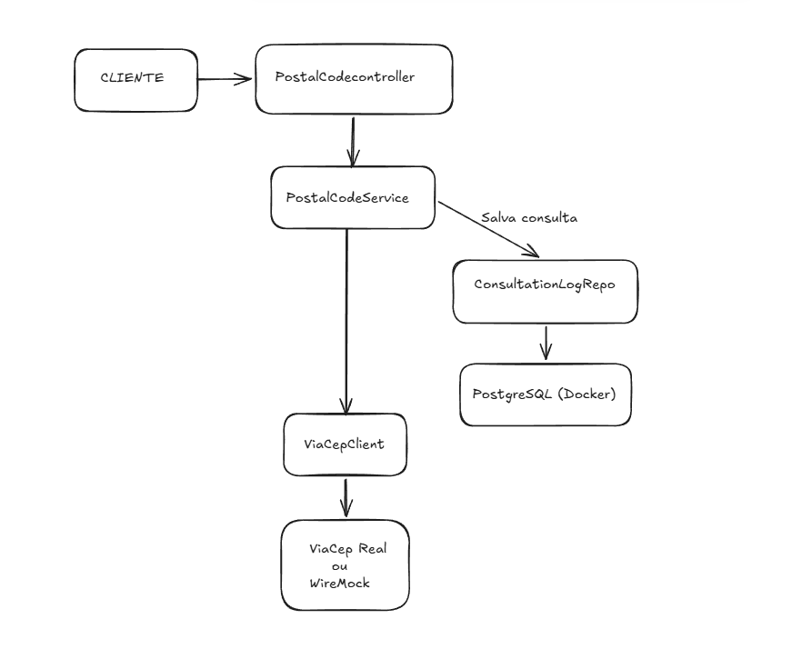
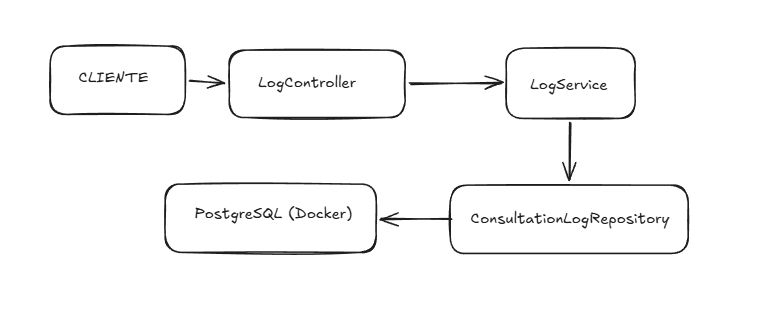
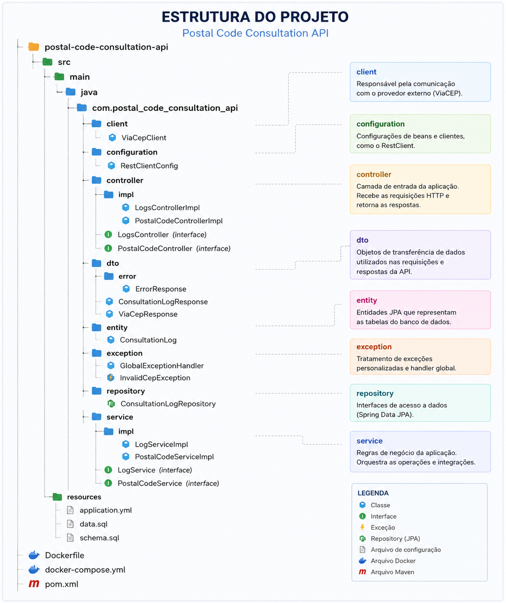

# 📮 Postal Code Consultation API

API REST desenvolvida em **Java** e **Spring Boot** para consulta de CEP através de um provedor externo (**ViaCEP**), com persistência do histórico de consultas em banco de dados **PostgreSQL**.

---

## 🎯 Objetivo

O projeto foi desenvolvido como solução para um desafio técnico, demonstrando:

- Arquitetura em camadas
- Boas práticas de desenvolvimento
- Aplicação dos princípios **SOLID**
- Integração com APIs externas
- Persistência de dados
- Documentação de APIs
- Containerização com Docker
- Simulação de serviços externos utilizando **WireMock**

---

## 🏗️ Arquitetura da Solução

**Fluxo de consulta de CEP:**



**Fluxo de consulta de logs:**



---

## ⚙️ Tecnologias Utilizadas
- Java 17
- Spring Boot 3
- Spring Web
- Spring Data JPA
- PostgreSQL
- Docker
- WireMock
- Lombok
- Swagger / OpenAPI
- Maven

---

## 📂 Estrutura do Projeto


---

## 🚀 Funcionalidades
### 🔎 Consulta de CEP
Realiza consulta de CEP através de um provedor externo configurável.  
**Endpoint:**
GET /api/v1/cep/{cep}

**Exemplo:**
GET /api/v1/cep/01310100

**Resposta:**
```json
{
  "cep": "01310-100",
  "logradouro": "Avenida Paulista",
  "bairro": "Bela Vista",
  "localidade": "São Paulo",
  "uf": "SP"
}
```
## 📜 Histórico de Consultas
Retorna todas as consultas realizadas.

Endpoint: 
GET /api/v1/logs

## 🗄️ Persistência de Logs
### Cada consulta realizada gera um registro contendo:

CEP consultado

Data e hora da consulta

Resposta retornada pelo provedor externo

Essas informações são armazenadas na tabela:
consultation_log

## ⚠️ Tratamento de Exceções
### A aplicação possui tratamento centralizado de erros através de:

GlobalExceptionHandler

InvalidCepException

Exemplo de resposta:

```json
{
"timestamp": "2026-06-02T10:00:00",
"status": 400,
"error": "Bad Request",
"message": "CEP deve conter exatamente 8 dígitos"
}
```
## 📖 Documentação da API
Swagger UI: http://localhost:8080/swagger-ui/index.html

OpenAPI: http://localhost:8080/v3/api-docs

## 🛢️ Configuração do Banco de Dados
### A aplicação utiliza PostgreSQL executando em container Docker.
Subir ambiente:
```bash
  docker-compose up -d
```
### Verificar containers:
```bash
  docker ps
``` 
## 🧪 WireMock
### O projeto suporta a utilização de WireMock para simulação do provedor externo.
Configuração no application.yml:
```yaml
external:
  viacep:
    url: https://viacep.com.br/ws
```
### Para utilizar WireMock:
```yaml
external:
  viacep:
    url: http://localhost:8089/ws
```
### Nenhuma alteração de código é necessária para alternar entre ViaCEP e WireMock.

## 🧩 Princípios SOLID Aplicados
### 🔹 Single Responsibility Principle
## Cada camada possui responsabilidade única:

#### Controller → Recebe requisições

#### Service → Regras de negócio

#### Repository → Persistência

#### Client → Comunicação externa

### 🔹 Dependency Inversion Principle
Os componentes dependem de abstrações e injeção de dependência fornecida pelo Spring Framework.

### 🔹 Open/Closed Principle
### A integração externa pode ser substituída sem alteração das regras de negócio.

## ▶️ Como Executar
Clonar repositório:

```bash
  git clone <repository-url>
  ```
 Subir PostgreSQL e WireMock:


 ```bash
  docker compose up -d
 ```
Executar aplicação:

 ``` bash
    mvn spring-boot:run
 ```
Acessar Swagger:

http://localhost:8080/swagger-ui/index.html


## 👨‍💻 Autor
### Isaac Brian  
#### Desenvolvido como solução para desafio técnico utilizando Java, Spring Boot, PostgreSQL, Docker e WireMock.


